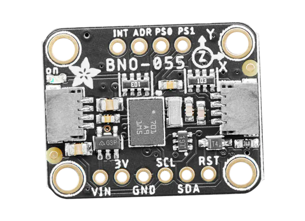
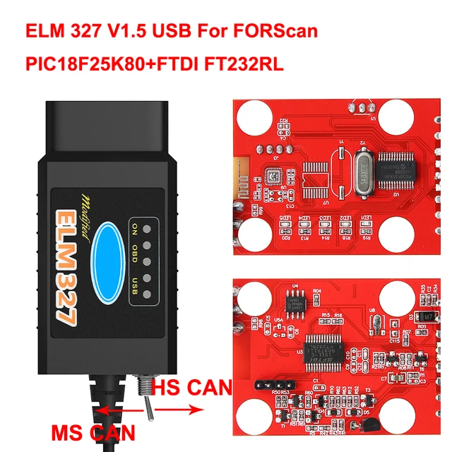

# Sistema de Coleta de dados veiculares (MobLab)

Projeto baseado na API do ESPRESSIF IDF versao 6.0.

==> Resumo do projeto <==

O codigo foi projetado para rodar no ESP32 S3 ligado ao módulo BNO055(9DOF) via I2C e ao módulo ELM327 (OBD-II) por USB.

## WIFI

O firmware é pre configurado para acessar a rede com SSID "moblab" e senha "futurelab", portanto basta criar um ponto de acesso com essas configurações.
Para trocar essa configuração de acesso, basta editar as seguintes definições no arquivo `./main/app_main.c`:

```C
#define WIFI_SSID "moblab"
#define WIFI_PASS "futurelab"
```

## LED RGB

O led RGB neopixel incluso no ESP32 S3 está configurado para indicar o estado de conexão wifi:

- Azul: procurando e conectando com ponto de acesso;
- Verde: conectado e operante;
- Vermelho: conexão mal sucedida.

Em caso de falha de conexão o dispositivo reiniciará até que se suceda a conexão. Neste caso o comportamente observavel do led será a luz azul ativa a maior parte do tempo, intercalando com a luz vermelha de menor duração. Isso indica problema de conexão.

## I2C (Acelerometro, giroscopio e magnetometro)



- Porta: I2C_NUM_0

- Frequencia: 400kHz

- Pinagem:
   - SDA: GPIO 1
   - SCL: GPIO 2

## USB (ELM327)



Host USB configurado para a classe CDC com Virtual COM Port (VCP) e drivers especiais para CH34X (interface com ELM327 acontece atraves de um CH340).

- Parametros de linha
    - 38400 bauds/s
    - 8N1

- Pinagem:
    - D+: GPIO 20 (Fio Verde)
    - D-: GPIO 19 (Fio Branco)

## Codigo

- IDF Components:
  - `usb_host_ch34x_vcp`
  - `usb_host_vcp`
